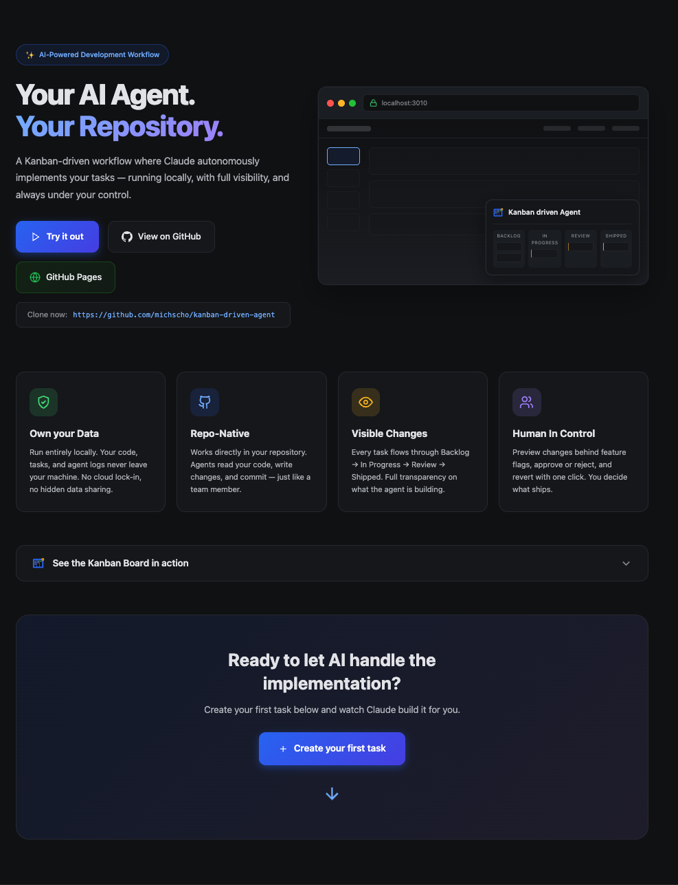

# Kanban Driven Agent



Kanban Driven Agent is a self-contained Next.js app where todos become agent-executed product changes. Add work to the board, run the Claude Agent SDK against the repository, preview the result behind a URL feature flag, then approve or revert the generated commits.

The project is intentionally small: the kanban UI, feature flag helpers, SQLite todo store, agent harness, and git commit/revert flow all live in this repo.

## What it does

- Tracks todo work across **Backlog**, **In Progress**, **Review**, and **Shipped** columns.
- Turns each todo title into a stable feature flag slug.
- Runs Claude Agent SDK on the local repository with a strict system prompt that requires new user-visible behavior to stay behind that flag.
- Streams agent output into the todo log so progress and failures are inspectable from the UI.
- Commits completed work automatically.
- Lets you preview one or more flags via `?feature=flag-one,flag-two`.
- Approves work by running a second agent pass that removes the selected flag gates and keeps the implementation.
- Reverts the recorded work and approval commits when a change should be rolled back.

## Workflow

1. Create a todo on `/` with a title and optional acceptance criteria.
2. Click **Run**. The app starts an agent job, moves the card to progress, and commits the result when files changed.
3. Preview the change at `http://localhost:3010/?feature=<todo-slug>`.
4. In **Review**, choose:
   - **Approve** to strip the feature flag and ship the implementation.
   - **Revert** to revert the recorded commits.
   - **Log** to inspect the agent run.
5. Approved work moves to **Shipped**.

## Requirements

- Node.js compatible with Next.js 15
- npm
- Git repository with commit access
- Anthropic API key for `@anthropic-ai/claude-agent-sdk`

## Setup

```bash
npm install
cp .env.example .env.local
```

Add your key to `.env.local`:

```bash
ANTHROPIC_API_KEY=sk-ant-...
```

Start the app:

```bash
npm run dev
```

Open `http://localhost:3010`.

## Feature Flags

Use the generated todo slug as the flag name. The active flags are read from the `feature` query parameter.

```tsx
import { Feature, useFeature } from '@/lib/features';

if (useFeature('add-dark-mode')) {
  // flagged logic
}

<Feature flag="add-dark-mode">
  <NewWidget />
</Feature>
```

Preview one flag:

```text
http://localhost:3010/?feature=add-dark-mode
```

Preview multiple flags:

```text
http://localhost:3010/?feature=add-dark-mode,new-dashboard
```

## Project Structure

```text
app/                 Next.js app and API routes
components/          Shared React components
data/                Local SQLite database directory
lib/agent.ts         Claude Agent SDK harness and prompts
lib/db.ts            better-sqlite3 todo store
lib/features.tsx     URL-driven feature flag helpers
lib/git.ts           Commit and revert helpers
```

The SQLite database lives at `data/todos.db` and is ignored by git.

## Commands

```bash
npm run dev      # Start Next.js on port 3010
npm run build    # Build the production app
npm run start    # Start the production server on port 3010
```

## Notes

- Agent runs intentionally commit through the harness; the system prompt tells the agent not to run git commands itself.
- New user-visible code should be gated with `useFeature()` or `<Feature>`.
- Approval removes the selected feature flag gates and commits the unwrapped implementation.
- Revert applies `git revert` to the approval commit first, then the original work commit.
